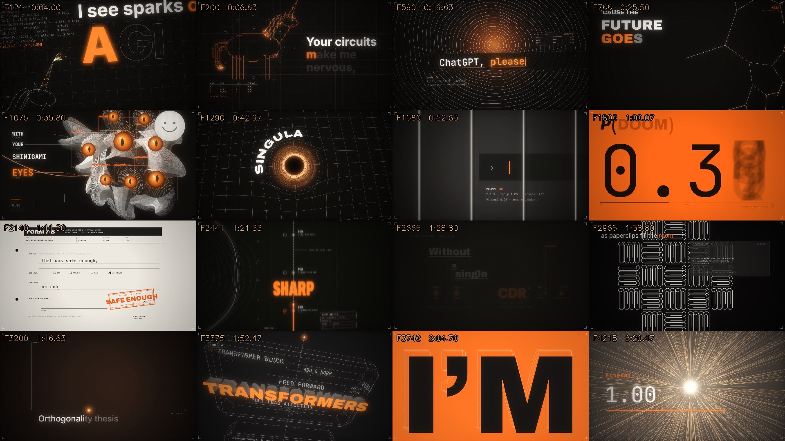

# This isn't a video. It's code.

A 2.5-minute AI music video, rebuilt as a **live website**: every one of its 4,700 frames is drawn by JavaScript in the browser. There are no video files and no images of the scenes.

**▶ Live:** https://shivam-24-deep.github.io/sparks-of-agi-in-code/

## Credit

- **Original music video:** shared on X, creator unknown (if this is your work, please reach out and I will credit you). The visual design and the song belong to the original creator. This project is a recreation in code, and the song is not included.
- **Website, idea and direction:** Shivam Deep
- **Code:** written by Claude Opus 5.5 in Claude Code, directed and reviewed by me

## What I did

1. Split the original video into all 4,700 frames and ran a frame-by-frame QA check (timing, cuts, flicker).
2. Planned the rebuild in 9 parts (about 500 frames each) and had Claude Code build them one at a time.
3. After each part, compared the website side by side with the original frames and asked for fixes until they matched.
4. Added my own features: a "behind the scenes" mode, a name-in-the-credits link, and an end credit.

## Try it

| Key / link | What it does |
|---|---|
| `Space` | play / pause |
| `←` `→` | step one frame (`Shift` = one second) |
| `D` | **behind the scenes**: frame number, draw time per frame, scene timeline |
| `F` | fullscreen |
| `?name=YourName` | the pen writes your name in the end credits, e.g. [`?name=Rahul`](https://shivam-24-deep.github.io/sparks-of-agi-in-code/?name=Rahul) |
| `?ui=0` | clean view without controls (for screen recording) |
| `?f=3375` | open at a specific frame |

## How it works

- **Timeline + engine** (`js/engine.js`): each scene has a start and end time. Every frame, the engine finds the active scenes for time `t` and asks them to draw.
- **Scenes** (`js/scenes/part1.js` … `part9.js`, `credits.js`): 49 scenes. Each is a `draw(ctx, t)` function on an HTML Canvas (1920×1080).
- **Shared tools** (`js/core.js`): easing and keyframes, karaoke-style lyrics, a 2D camera, a small 3D camera (perspective projection) for the wireframe scenes, and post effects (bloom, grain, vignette).
- Because every frame is a function of time, you can jump to any frame, slow it to 0.1× or scrub backwards, and it stays sharp at any screen size.

Numbers: about 7,500 lines of JavaScript, 49 scenes, 4,790 frames (the original's 4,700 plus a 3-second credit), 30 fps.

## Run locally

Open `index.html` in Chrome. No build step and no install.

To add music you have the rights to, put it at `audio/song.mp3`, or use the **♪ Add song** button.
